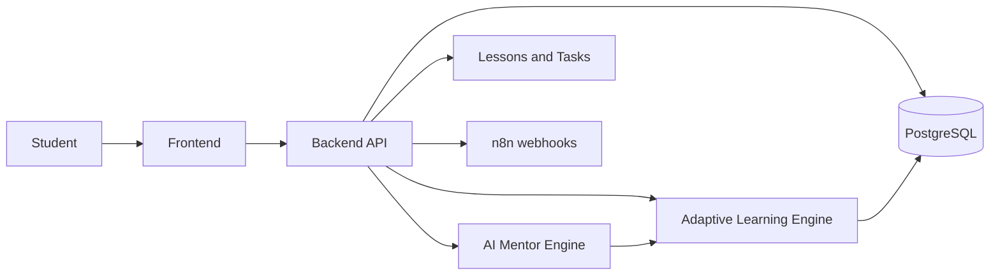
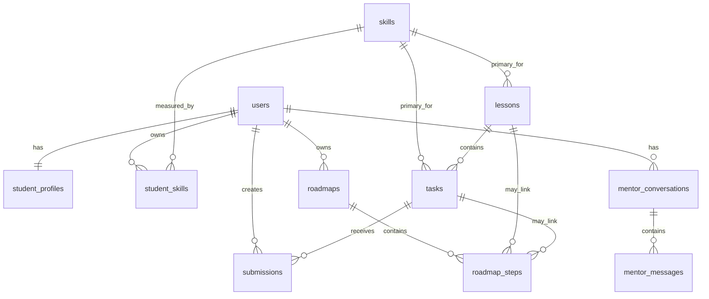

# Handoff: AI Mentor

Документ для передачи проекта на удаленный сервер и продолжения разработки.

## 1. Краткое состояние

AI Mentor - образовательная платформа с персональным AI-наставником. Целевая система должна помогать студенту проходить уроки, выполнять задания, получать персональные рекомендации, вести roadmap обучения и общаться с AI-наставником в контексте своего прогресса.

Текущий репозиторий находится на стадии проектирования и MVP-заготовки:

- есть общая документация проекта в `README.md` и `docs/PROJECT.md`;
- есть согласованная MVP-схема PostgreSQL в `database/mvp_schema.sql`;
- есть self-review схемы в `database/review.md`;
- директории `backend/`, `frontend/`, `lessons/`, `tasks/`, `n8n/` созданы как каркас, но прикладного кода и workflow в них пока нет;
- технологический стек backend/frontend еще не зафиксирован;
- команды запуска, сборки и деплоя пока отсутствуют.

## 2. Структура репозитория

```text
AI-Mentor/
├── backend/               # Будущий Backend API и бизнес-логика
├── frontend/              # Будущий пользовательский интерфейс
├── database/
│   ├── mvp_schema.sql     # Актуальная MVP-схема PostgreSQL
│   └── review.md          # Обзор и rationale по схеме
├── docs/
│   ├── PROJECT.md         # Расширенная архитектурная документация
│   └── HANDOFF.md         # Этот документ
├── lessons/               # Будущий контент уроков, например Markdown
├── tasks/                 # Будущие задания и шаблоны упражнений
├── n8n/                   # Будущие workflow автоматизаций
├── roadmap.md/            # Текущая директория/артефакт roadmap
└── README.md              # Общее описание проекта
```

## 3. Архитектура

Целевая архитектура модульная:



### Frontend

Будущий frontend должен быть рабочим кабинетом студента. Основные экраны из проектной документации:

- dashboard;
- персональный roadmap;
- карта навыков;
- экран урока;
- экран задания;
- чат с AI-наставником;
- история отправок и обратной связи.

Текущий статус: код frontend не реализован.

### Backend API

Backend должен отвечать за:

- аутентификацию и профиль студента;
- выдачу уроков и заданий;
- прием и проверку ответов;
- расчет прогресса по навыкам;
- построение и обновление roadmap;
- хранение истории диалогов с AI-наставником;
- интеграции с AI-моделью и n8n.

Рекомендуемые API-группы для MVP:

```text
/auth
/users
/skills
/lessons
/tasks
/submissions
/roadmaps
/mentor
```

Текущий статус: код backend не реализован.

### AI Mentor Engine

AI Mentor Engine пока описан концептуально. Он должен формировать ответы на основе:

- цели обучения студента;
- текущего уровня;
- состояния навыков;
- текущего урока, задания или roadmap step;
- истории сообщений;
- результатов отправок и feedback.

На MVP-этапе достаточно реализовать его как backend-сервис/модуль, который собирает контекст из БД и вызывает AI API.

### Adaptive Learning Engine

Адаптивный слой должен обновлять прогресс после значимых событий:

- студент завершил урок;
- отправил задание;
- получил оценку/feedback;
- завершил шаг roadmap;
- написал наставнику в контексте урока или задания.

В текущей MVP-схеме это отражается через `student_skills`, `submissions`, `roadmaps` и `roadmap_steps`. Более полная event-модель описана в `docs/PROJECT.md`, но пока не включена в MVP-схему.

### n8n

n8n планируется для напоминаний, отчетов, регулярных проверок прогресса и внешних автоматизаций. Сейчас workflow отсутствуют, директория `n8n/` пустая.

## 4. Схема базы данных

Актуальный файл: `database/mvp_schema.sql`.

Целевая СУБД: PostgreSQL 16+.

Схема использует:

- расширение `pgcrypto` для `gen_random_uuid()`;
- UUID primary keys;
- `timestamptz` для дат;
- `jsonb` для гибких полей MVP;
- check constraints для статусов и enum-подобных значений;
- триггер `set_updated_at()` для таблиц с `updated_at`.

### Таблицы MVP

#### `users`

Пользователи системы.

Ключевые поля:

- `id`;
- `email`;
- `password_hash`;
- `display_name`;
- `role`: `student`, `admin`, `mentor`;
- `status`: `active`, `inactive`, `blocked`;
- `last_login_at`;
- `created_at`, `updated_at`.

Связи: родительская таблица для профилей, навыков, отправок, roadmap и диалогов.

#### `student_profiles`

Профиль студента, один к одному с `users`.

Ключевые поля:

- `user_id`;
- `learning_goal`;
- `current_level`;
- `preferred_language`;
- `timezone`;
- `weekly_study_minutes`;
- `metadata`.

Ограничения: `UNIQUE (user_id)`, `weekly_study_minutes >= 0`.

#### `skills`

Каталог навыков.

Ключевые поля:

- `code`;
- `title`;
- `description`;
- `category`;
- `status`: `active`, `archived`.

Ограничения: `code` уникален.

#### `student_skills`

Состояние навыка у конкретного студента.

Ключевые поля:

- `student_id`;
- `skill_id`;
- `level`: 0-5;
- `confidence`: 0-1;
- `attempts_count`;
- `successful_attempts_count`;
- `last_practiced_at`;
- `evidence`.

Ограничения: одна запись на пару `(student_id, skill_id)`.

#### `lessons`

Метаданные уроков.

Ключевые поля:

- `primary_skill_id`;
- `slug`;
- `title`;
- `summary`;
- `content_path`;
- `difficulty`: 1-5;
- `estimated_minutes`;
- `status`: `draft`, `published`, `archived`;
- `prerequisites`.

Важно: контент уроков не хранится в БД. В БД хранится путь `content_path`, например к Markdown-файлу в `lessons/`.

#### `tasks`

Учебные задания.

Ключевые поля:

- `lesson_id`;
- `primary_skill_id`;
- `slug`;
- `title`;
- `description`;
- `task_type`: `sql`, `text`, `quiz`, `project`, `review`, `diagnostic`;
- `difficulty`: 1-5;
- `instructions`;
- `expected_answer`;
- `validation_strategy`: `ai`, `exact_match`, `sql_result`, `manual`;
- `status`: `draft`, `published`, `archived`.

#### `submissions`

Отправки ответов студентами.

Ключевые поля:

- `student_id`;
- `task_id`;
- `answer`;
- `score`: 0-1 или `NULL`;
- `feedback`;
- `status`: `submitted`, `reviewed`, `accepted`, `rejected`, `needs_revision`;
- `submitted_at`;
- `reviewed_at`.

Используется для повторных попыток, AI/manual review и обновления прогресса.

#### `roadmaps`

Персональные планы обучения.

Ключевые поля:

- `student_id`;
- `title`;
- `goal`;
- `status`: `draft`, `active`, `completed`, `archived`;
- `version`;
- `starts_at`;
- `completed_at`;
- `metadata`.

Ограничение: частичный уникальный индекс разрешает только один активный roadmap на студента.

#### `roadmap_steps`

Шаги персонального roadmap.

Ключевые поля:

- `roadmap_id`;
- `skill_id`;
- `lesson_id`;
- `task_id`;
- `position`;
- `step_type`: `lesson`, `task`, `practice`, `review`, `diagnostic`, `mentor`;
- `title`;
- `description`;
- `difficulty`;
- `status`: `locked`, `available`, `in_progress`, `completed`, `skipped`;
- `expected_outcome`;
- `due_at`, `started_at`, `completed_at`.

Ограничение: уникальная позиция внутри roadmap через `(roadmap_id, position)`.

#### `mentor_conversations`

Диалоги студента с AI-наставником.

Ключевые поля:

- `student_id`;
- `context_type`: `general`, `lesson`, `task`, `roadmap`, `submission`;
- `context_id`;
- `title`;
- `status`: `active`, `archived`.

`context_id` полиморфный, поэтому приложение должно валидировать ссылку на сущность.

#### `mentor_messages`

Сообщения в диалогах.

Ключевые поля:

- `conversation_id`;
- `role`: `student`, `assistant`, `system`;
- `content`;
- `metadata`;
- `created_at`.

Сообщения считаются append-only для MVP.

### Основные связи



### Индексы и производительность

Схема уже содержит индексы под основные MVP-запросы:

- поиск пользователя по `email` через unique constraint;
- загрузка профиля по `student_profiles.user_id`;
- карта навыков студента по `student_skills`;
- список уроков/заданий по `status` и `difficulty`;
- отправки по студенту, статусу и заданию;
- активный roadmap студента;
- шаги roadmap по статусу и позиции;
- последние диалоги и сообщения наставника.

Не добавлены намеренно:

- полнотекстовый поиск;
- GIN-индексы по всем `jsonb`;
- партиционирование сообщений/отправок;
- many-to-many таблицы `lesson_skills` и `task_skills`.

Их стоит добавлять после появления реальных запросов и нагрузки.

## 5. Что отложено за пределы MVP

В полной архитектуре описаны, но в `mvp_schema.sql` пока не реализованы:

- система типовых ошибок `mistakes`;
- SQL Sandbox datasets и query logs;
- учебные проекты;
- диагностики/assessments;
- рекомендации;
- `learning_events`;
- журнал запусков автоматизаций `automation_runs`;
- n8n workflow.

Это осознанное ограничение: текущая схема фиксирует первый вертикальный срез - пользователь, профиль, навыки, уроки, задания, отправки, roadmap и чат наставника.

## 6. Подготовка к удаленному серверу

Минимальные шаги для переноса текущего состояния:

1. Скопировать репозиторий на сервер.
2. Установить PostgreSQL 16+.
3. Создать базу данных и пользователя приложения.
4. Применить схему:

```bash
psql "$DATABASE_URL" -f database/mvp_schema.sql
```

5. Создать `.env` на сервере, не коммитить его в репозиторий.

Рекомендуемые переменные окружения:

```env
APP_ENV=production
APP_URL=
API_URL=
DATABASE_URL=
SANDBOX_DATABASE_URL=
OPENAI_API_KEY=
N8N_WEBHOOK_URL=
JWT_SECRET=
```

На текущем этапе backend/frontend не запускаются, потому что исполняемый код еще не добавлен.

## 7. Рекомендуемый следующий план разработки

1. Зафиксировать стек backend и frontend.
2. Добавить базовый backend-проект с конфигурацией, подключением к PostgreSQL и миграциями.
3. Перенести `database/mvp_schema.sql` в выбранный механизм миграций.
4. Реализовать auth и CRUD/чтение для `users`, `student_profiles`, `skills`.
5. Добавить чтение каталога уроков и заданий.
6. Реализовать `submissions` с базовой AI/manual проверкой.
7. Реализовать персональный roadmap и обновление `roadmap_steps`.
8. Добавить чат наставника: `mentor_conversations` и `mentor_messages`.
9. Создать первый контент в `lessons/` и `tasks/`.
10. После рабочего MVP подключить n8n и расширенные сущности из `docs/PROJECT.md`.

## 8. Риски и замечания

- В репозитории пока нет package/build/runtime файлов, поэтому серверный деплой сейчас означает только перенос документации и схемы БД.
- `context_id` в `mentor_conversations` полиморфный: целостность должна проверяться на уровне backend.
- `jsonb` поля удобны для MVP, но часто используемые данные позже лучше выносить в явные колонки.
- Для SQL Sandbox нужна отдельная read-only база или схема, отдельный пользователь БД, `statement_timeout`, лимит строк и запрет опасных/multi-statement запросов.
- Секреты должны храниться только в окружении сервера или secret manager.

## 9. Definition of Done для ближайшего MVP

MVP можно считать рабочим, когда:

- пользователь может зарегистрироваться/войти;
- у пользователя есть профиль и цель обучения;
- есть каталог навыков, уроков и заданий;
- студент может отправить ответ на задание;
- система сохраняет score/feedback;
- прогресс по навыкам обновляется;
- у студента есть активный roadmap с шагами;
- чат наставника сохраняет историю и отвечает с учетом контекста;
- базовый пользовательский сценарий можно пройти вручную от входа до feedback.
