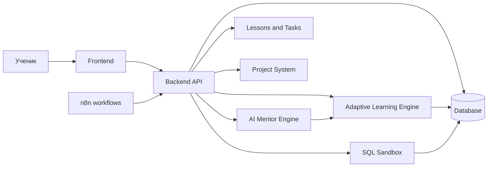
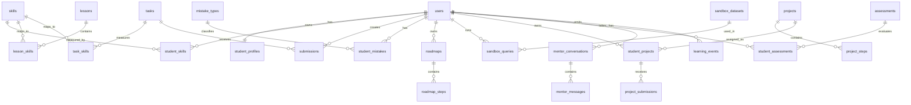

# Документация проекта AI Mentor

## 1. Обзор

AI Mentor - персональный AI-наставник для обучения аналитике, SQL, продуктовой логике и практическим проектам. Система не просто показывает уроки, а строит индивидуальную траекторию обучения, оценивает уровень ученика, отслеживает навыки, фиксирует типовые ошибки, подбирает задания и помогает доводить учебные проекты до результата.

Ключевая идея проекта: у каждого ученика есть динамический профиль компетенций. На его основе AI-наставник решает, что дать дальше: объяснение, тренировку, SQL-задачу, повторение слабого навыка, проектную работу или проверку уровня.

## 2. Целевые возможности

- система навыков `skills`;
- система ошибок `mistakes`;
- персональные roadmap для каждого ученика;
- SQL Sandbox для выполнения учебных SQL-запросов;
- система учебных проектов;
- адаптивное обучение;
- оценка уровня ученика;
- AI-наставник с контекстом по прогрессу, ошибкам, проектам и целям;
- автоматизации через n8n для напоминаний, отчетов и регулярных проверок.

## 3. Модульная архитектура



### 3.1 Frontend

Frontend должен быть рабочим кабинетом ученика, а не витриной курса.

Основные экраны:

- dashboard ученика;
- личный roadmap;
- карта навыков;
- урок;
- задание;
- SQL Sandbox;
- проектная область;
- история ошибок;
- чат с AI-наставником;
- оценка уровня и результаты диагностик.

### 3.2 Backend

Backend отвечает за:

- авторизацию и профиль ученика;
- выдачу уроков, заданий и проектов;
- расчет прогресса;
- хранение навыков и ошибок;
- запуск адаптивного подбора следующего шага;
- интеграцию с AI-моделью;
- безопасный запуск SQL-запросов в sandbox;
- API для n8n-webhook.

Рекомендуемые API-группы:

```text
/auth
/users
/skills
/mistakes
/roadmaps
/lessons
/tasks
/submissions
/sandbox
/projects
/assessments
/mentor
/recommendations
/webhooks
```

### 3.3 AI Mentor Engine

AI Mentor Engine формирует персональные ответы на основе:

- цели ученика;
- текущего уровня;
- освоенных и слабых навыков;
- последних ошибок;
- активного roadmap;
- текущего урока или проекта;
- истории сообщений;
- результатов SQL-запросов и заданий.

AI-наставник должен уметь:

- объяснять материал простым языком;
- задавать уточняющие вопросы;
- находить причину ошибки;
- предлагать короткую тренировку;
- менять сложность;
- подводить ученика к решению, не отдавая ответ сразу;
- формировать рекомендации для следующего шага.

### 3.4 Adaptive Learning Engine

Adaptive Learning Engine - слой принятия решений. Он обновляет учебную траекторию после каждого значимого события: выполненного задания, ошибки, сообщения наставнику, SQL-запроса, оценки уровня или завершения проекта.

Основные правила:

- если навык слабый, система дает повторение или более простую задачу;
- если ученик стабильно решает задачи, система повышает сложность;
- если ошибка повторяется, система создает отдельную тренировку;
- если ученик застрял, AI-наставник предлагает подсказку или микроурок;
- если прогресс идет быстро, roadmap сокращается и переходит к проектам.

## 4. Пользовательские сценарии

### 4.1 Первый вход и оценка уровня

1. Ученик указывает цель обучения.
2. Система предлагает короткую диагностику.
3. Ученик решает задания разного типа.
4. Backend рассчитывает уровень по навыкам.
5. AI-наставник объясняет результат.
6. Система создает персональный roadmap.

### 4.2 Прохождение персонального roadmap

1. Ученик открывает dashboard.
2. Видит текущий шаг roadmap.
3. Изучает материал или выполняет задание.
4. Система обновляет навыки и ошибки.
5. Adaptive Learning Engine выбирает следующий шаг.
6. AI-наставник кратко объясняет, почему следующий шаг выбран именно так.

### 4.3 Работа с SQL Sandbox

1. Ученик получает SQL-задачу.
2. Открывает SQL Sandbox.
3. Пишет и запускает запрос.
4. Sandbox выполняет запрос в изолированной учебной среде.
5. Система сравнивает результат с ожидаемым.
6. Ошибки SQL сохраняются в `mistakes`.
7. AI-наставник объясняет ошибку и предлагает исправление.

### 4.4 Работа над проектом

1. Ученик выбирает или получает проект.
2. Проект разбивается на этапы.
3. Каждый этап связан с навыками.
4. Ученик загружает результат или выполняет задачу.
5. AI-наставник дает ревью.
6. Система обновляет прогресс проекта и карту навыков.

### 4.5 Повторяющаяся ошибка

1. Ученик несколько раз допускает ошибку одного типа.
2. Система увеличивает счетчик повторений.
3. Ошибка получает статус `active`.
4. Adaptive Learning Engine добавляет тренировку в roadmap.
5. После успешной серии решений ошибка переводится в `resolved`.

## 5. Система навыков

Навык - измеримая единица компетенции. Навыки используются для диагностики, roadmap, заданий, проектов и адаптивного обучения.

Примеры навыков:

- `sql_select_basics`;
- `sql_joins`;
- `sql_group_by`;
- `data_cleaning`;
- `metric_thinking`;
- `hypothesis_formulation`;
- `project_decomposition`;
- `dashboard_interpretation`.

Для каждого ученика система хранит:

- текущий уровень навыка;
- уверенность оценки;
- количество попыток;
- дату последней практики;
- динамику роста;
- связанные ошибки.

Рекомендуемая шкала:

| Уровень | Значение |
| --- | --- |
| 0 | Навык не изучался |
| 1 | Начальный уровень |
| 2 | Понимает с подсказками |
| 3 | Решает типовые задачи |
| 4 | Решает сложные задачи |
| 5 | Может применять в проектах |

## 6. Система ошибок

Ошибка - повторяемый паттерн, который мешает ученику решать задачи. Ошибка должна быть связана с навыком и конкретными попытками.

Типы ошибок:

- синтаксическая ошибка SQL;
- логическая ошибка в запросе;
- неверная интерпретация условия;
- неправильный выбор метрики;
- пропущенная фильтрация;
- неверное объединение таблиц;
- слабое объяснение вывода;
- отсутствие проверки гипотезы.

Статусы ошибок:

| Статус | Описание |
| --- | --- |
| `new` | Ошибка обнаружена впервые |
| `active` | Ошибка повторяется |
| `training` | По ошибке назначена тренировка |
| `resolved` | Ошибка закрыта успешными попытками |
| `ignored` | Ошибка не влияет на текущий roadmap |

## 7. Персональные roadmap

Roadmap - индивидуальный план обучения ученика. Он строится на основе цели, диагностики, навыков, ошибок и доступного времени.

Roadmap состоит из шагов:

- урок;
- задание;
- SQL-тренировка;
- повторение;
- диагностика;
- проектный этап;
- ревью с AI-наставником.

Каждый шаг должен иметь:

- цель;
- связанный навык;
- сложность;
- ожидаемый результат;
- критерий завершения;
- причину назначения.

## 8. SQL Sandbox

SQL Sandbox - изолированная среда для учебных запросов.

Требования:

- запуск только разрешенных SQL-команд;
- ограничение времени выполнения;
- ограничение количества строк;
- запрет destructive-запросов;
- отдельные учебные датасеты;
- сохранение истории запросов;
- сравнение результата с эталоном;
- передача ошибок в систему mistakes.

Разрешенные команды на первом этапе:

```text
SELECT
WITH
EXPLAIN
```

Запрещенные команды:

```text
INSERT
UPDATE
DELETE
DROP
ALTER
CREATE
TRUNCATE
GRANT
REVOKE
```

## 9. Система проектов

Проект - практическая работа, которая объединяет несколько навыков.

Пример проекта:

```text
Исследовать поведение пользователей учебного продукта:
1. изучить таблицы;
2. сформулировать вопросы;
3. написать SQL-запросы;
4. посчитать ключевые метрики;
5. сделать выводы;
6. получить ревью AI-наставника.
```

Проект состоит из этапов. Каждый этап связан с навыками и критериями проверки.

Статусы проекта:

| Статус | Описание |
| --- | --- |
| `draft` | Проект создан, но не выдан ученику |
| `active` | Ученик работает над проектом |
| `review` | Ожидается ревью |
| `completed` | Проект завершен |
| `archived` | Проект скрыт из активной работы |

## 10. Оценка уровня ученика

Оценка уровня должна быть не одной общей цифрой, а набором оценок по навыкам и доменам.

Компоненты оценки:

- стартовая диагностика;
- результаты заданий;
- качество SQL-запросов;
- частота и тяжесть ошибок;
- скорость самостоятельного исправления;
- проектные результаты;
- ответы в диалоге с AI-наставником.

Итоговый уровень ученика:

| Уровень | Описание |
| --- | --- |
| `beginner` | Требуются базовые объяснения и простые задачи |
| `junior` | Решает типовые задачи с подсказками |
| `middle` | Самостоятельно решает большинство практических задач |
| `strong_middle` | Уверенно работает с комплексными задачами и проектами |
| `advanced` | Может объяснять решения и выбирать подход без подсказок |

## 11. Подробная структура базы данных

Ниже описана логическая схема. Типы данных можно адаптировать под выбранную СУБД, но базовая рекомендация - PostgreSQL.

### 11.1 `users`

Пользователи платформы.

| Поле | Тип | Описание |
| --- | --- | --- |
| `id` | uuid PK | Идентификатор пользователя |
| `email` | varchar unique | Email |
| `password_hash` | varchar nullable | Хэш пароля, если используется email/password |
| `name` | varchar | Имя |
| `role` | varchar | `student`, `mentor`, `admin` |
| `status` | varchar | `active`, `paused`, `blocked` |
| `created_at` | timestamp | Дата создания |
| `updated_at` | timestamp | Дата обновления |

Индексы:

- unique index on `email`;
- index on `status`.

### 11.2 `student_profiles`

Учебный профиль ученика.

| Поле | Тип | Описание |
| --- | --- | --- |
| `id` | uuid PK | Идентификатор профиля |
| `user_id` | uuid FK -> users.id | Ученик |
| `goal` | text | Цель обучения |
| `target_role` | varchar nullable | Желаемая роль или направление |
| `current_level` | varchar | Общий уровень ученика |
| `weekly_time_minutes` | integer | Сколько минут в неделю ученик готов учиться |
| `preferred_difficulty` | varchar | `easy`, `normal`, `hard` |
| `mentor_style` | varchar | Стиль объяснений AI-наставника |
| `created_at` | timestamp | Дата создания |
| `updated_at` | timestamp | Дата обновления |

Связи:

- один `users` имеет один `student_profiles`;
- профиль используется при генерации roadmap и рекомендаций.

### 11.3 `skills`

Справочник навыков.

| Поле | Тип | Описание |
| --- | --- | --- |
| `id` | uuid PK | Идентификатор навыка |
| `code` | varchar unique | Машинный код навыка |
| `title` | varchar | Название |
| `description` | text | Описание |
| `domain` | varchar | Область: `sql`, `analytics`, `product`, `projects` |
| `parent_skill_id` | uuid nullable FK -> skills.id | Родительский навык |
| `level_order` | integer | Порядок изучения |
| `is_active` | boolean | Доступен ли навык |

Индексы:

- unique index on `code`;
- index on `domain`;
- index on `parent_skill_id`.

### 11.4 `student_skills`

Текущее состояние навыков конкретного ученика.

| Поле | Тип | Описание |
| --- | --- | --- |
| `id` | uuid PK | Идентификатор записи |
| `student_id` | uuid FK -> users.id | Ученик |
| `skill_id` | uuid FK -> skills.id | Навык |
| `level` | integer | Уровень от 0 до 5 |
| `confidence` | numeric | Уверенность оценки от 0 до 1 |
| `attempts_count` | integer | Количество попыток |
| `success_count` | integer | Количество успешных попыток |
| `last_practiced_at` | timestamp nullable | Последняя практика |
| `next_review_at` | timestamp nullable | Дата следующего повторения |
| `updated_at` | timestamp | Дата обновления |

Ограничения:

- unique constraint on `student_id`, `skill_id`;
- check `level between 0 and 5`;
- check `confidence between 0 and 1`.

### 11.5 `lessons`

Учебные материалы.

| Поле | Тип | Описание |
| --- | --- | --- |
| `id` | uuid PK | Идентификатор урока |
| `slug` | varchar unique | URL-код |
| `title` | varchar | Название |
| `description` | text | Краткое описание |
| `content_path` | varchar | Путь к Markdown-файлу или контенту |
| `difficulty` | integer | Сложность от 1 до 5 |
| `estimated_minutes` | integer | Оценка времени |
| `status` | varchar | `draft`, `published`, `archived` |
| `created_at` | timestamp | Дата создания |
| `updated_at` | timestamp | Дата обновления |

### 11.6 `lesson_skills`

Связь уроков с навыками.

| Поле | Тип | Описание |
| --- | --- | --- |
| `lesson_id` | uuid FK -> lessons.id | Урок |
| `skill_id` | uuid FK -> skills.id | Навык |
| `weight` | numeric | Вклад урока в навык |

Ограничения:

- primary key on `lesson_id`, `skill_id`.

### 11.7 `tasks`

Практические задания.

| Поле | Тип | Описание |
| --- | --- | --- |
| `id` | uuid PK | Идентификатор задания |
| `lesson_id` | uuid nullable FK -> lessons.id | Связанный урок |
| `title` | varchar | Название |
| `type` | varchar | `text`, `quiz`, `sql`, `project_step` |
| `prompt` | text | Условие |
| `difficulty` | integer | Сложность от 1 до 5 |
| `expected_answer` | jsonb nullable | Эталон или правила проверки |
| `check_strategy` | varchar | `manual`, `ai`, `sql_result`, `unit_test` |
| `status` | varchar | `draft`, `published`, `archived` |
| `created_at` | timestamp | Дата создания |
| `updated_at` | timestamp | Дата обновления |

### 11.8 `task_skills`

Связь заданий с навыками.

| Поле | Тип | Описание |
| --- | --- | --- |
| `task_id` | uuid FK -> tasks.id | Задание |
| `skill_id` | uuid FK -> skills.id | Навык |
| `weight` | numeric | Вклад задания в оценку навыка |

Ограничения:

- primary key on `task_id`, `skill_id`.

### 11.9 `submissions`

Ответы ученика на задания.

| Поле | Тип | Описание |
| --- | --- | --- |
| `id` | uuid PK | Идентификатор попытки |
| `student_id` | uuid FK -> users.id | Ученик |
| `task_id` | uuid FK -> tasks.id | Задание |
| `answer` | jsonb | Ответ ученика |
| `score` | numeric nullable | Балл от 0 до 1 |
| `status` | varchar | `submitted`, `checked`, `needs_revision`, `accepted` |
| `feedback` | text nullable | Обратная связь |
| `checked_by` | varchar | `system`, `ai`, `mentor` |
| `created_at` | timestamp | Дата отправки |
| `checked_at` | timestamp nullable | Дата проверки |

Индексы:

- index on `student_id`, `created_at`;
- index on `task_id`;
- index on `status`.

### 11.10 `mistake_types`

Справочник типов ошибок.

| Поле | Тип | Описание |
| --- | --- | --- |
| `id` | uuid PK | Идентификатор типа ошибки |
| `code` | varchar unique | Машинный код |
| `title` | varchar | Название |
| `description` | text | Описание |
| `domain` | varchar | Область ошибки |
| `severity_default` | integer | Базовая тяжесть от 1 до 5 |

### 11.11 `student_mistakes`

Конкретные ошибки ученика.

| Поле | Тип | Описание |
| --- | --- | --- |
| `id` | uuid PK | Идентификатор ошибки |
| `student_id` | uuid FK -> users.id | Ученик |
| `mistake_type_id` | uuid FK -> mistake_types.id | Тип ошибки |
| `skill_id` | uuid nullable FK -> skills.id | Связанный навык |
| `submission_id` | uuid nullable FK -> submissions.id | Попытка, где ошибка найдена |
| `sandbox_query_id` | uuid nullable FK -> sandbox_queries.id | SQL-запрос, где ошибка найдена |
| `title` | varchar | Короткое описание |
| `details` | text | Подробности |
| `severity` | integer | Тяжесть от 1 до 5 |
| `repeat_count` | integer | Сколько раз повторялась |
| `status` | varchar | `new`, `active`, `training`, `resolved`, `ignored` |
| `first_seen_at` | timestamp | Первое появление |
| `last_seen_at` | timestamp | Последнее появление |
| `resolved_at` | timestamp nullable | Дата закрытия |

Индексы:

- index on `student_id`, `status`;
- index on `skill_id`;
- index on `mistake_type_id`;
- index on `last_seen_at`.

### 11.12 `roadmaps`

Персональные учебные планы.

| Поле | Тип | Описание |
| --- | --- | --- |
| `id` | uuid PK | Идентификатор roadmap |
| `student_id` | uuid FK -> users.id | Ученик |
| `title` | varchar | Название |
| `goal` | text | Цель roadmap |
| `status` | varchar | `draft`, `active`, `completed`, `paused`, `archived` |
| `source` | varchar | `diagnostic`, `manual`, `adaptive` |
| `started_at` | timestamp nullable | Старт |
| `completed_at` | timestamp nullable | Завершение |
| `created_at` | timestamp | Дата создания |
| `updated_at` | timestamp | Дата обновления |

### 11.13 `roadmap_steps`

Шаги персонального roadmap.

| Поле | Тип | Описание |
| --- | --- | --- |
| `id` | uuid PK | Идентификатор шага |
| `roadmap_id` | uuid FK -> roadmaps.id | Roadmap |
| `position` | integer | Порядок |
| `type` | varchar | `lesson`, `task`, `sql_practice`, `review`, `assessment`, `project_step` |
| `lesson_id` | uuid nullable FK -> lessons.id | Связанный урок |
| `task_id` | uuid nullable FK -> tasks.id | Связанное задание |
| `project_step_id` | uuid nullable FK -> project_steps.id | Этап проекта |
| `skill_id` | uuid nullable FK -> skills.id | Главный навык |
| `title` | varchar | Название шага |
| `reason` | text | Почему шаг назначен |
| `status` | varchar | `locked`, `available`, `in_progress`, `completed`, `skipped` |
| `due_at` | timestamp nullable | Плановая дата |
| `completed_at` | timestamp nullable | Дата завершения |

Индексы:

- index on `roadmap_id`, `position`;
- index on `status`;
- index on `skill_id`.

### 11.14 `sandbox_datasets`

Учебные датасеты для SQL Sandbox.

| Поле | Тип | Описание |
| --- | --- | --- |
| `id` | uuid PK | Идентификатор датасета |
| `slug` | varchar unique | Код датасета |
| `title` | varchar | Название |
| `description` | text | Описание |
| `schema_name` | varchar | Имя схемы в sandbox-БД |
| `is_active` | boolean | Доступен ли датасет |
| `created_at` | timestamp | Дата создания |

### 11.15 `sandbox_tables`

Описание таблиц внутри учебных датасетов.

| Поле | Тип | Описание |
| --- | --- | --- |
| `id` | uuid PK | Идентификатор |
| `dataset_id` | uuid FK -> sandbox_datasets.id | Датасет |
| `table_name` | varchar | Имя таблицы |
| `description` | text | Что хранится в таблице |
| `columns_schema` | jsonb | Описание колонок |
| `row_count` | integer nullable | Примерное количество строк |

### 11.16 `sandbox_queries`

История SQL-запросов ученика.

| Поле | Тип | Описание |
| --- | --- | --- |
| `id` | uuid PK | Идентификатор запроса |
| `student_id` | uuid FK -> users.id | Ученик |
| `task_id` | uuid nullable FK -> tasks.id | Связанная SQL-задача |
| `dataset_id` | uuid FK -> sandbox_datasets.id | Датасет |
| `query_text` | text | SQL-запрос |
| `normalized_query_hash` | varchar | Хэш нормализованного запроса |
| `status` | varchar | `success`, `error`, `timeout`, `blocked` |
| `execution_ms` | integer nullable | Время выполнения |
| `result_preview` | jsonb nullable | Ограниченный preview результата |
| `error_message` | text nullable | Ошибка выполнения |
| `created_at` | timestamp | Дата запуска |

Индексы:

- index on `student_id`, `created_at`;
- index on `task_id`;
- index on `status`;
- index on `normalized_query_hash`.

### 11.17 `projects`

Справочник учебных проектов.

| Поле | Тип | Описание |
| --- | --- | --- |
| `id` | uuid PK | Идентификатор проекта |
| `slug` | varchar unique | Код проекта |
| `title` | varchar | Название |
| `description` | text | Описание |
| `difficulty` | integer | Сложность от 1 до 5 |
| `estimated_hours` | integer | Оценка времени |
| `dataset_id` | uuid nullable FK -> sandbox_datasets.id | Датасет для проекта |
| `status` | varchar | `draft`, `published`, `archived` |
| `created_at` | timestamp | Дата создания |
| `updated_at` | timestamp | Дата обновления |

### 11.18 `project_skills`

Связь проектов с навыками.

| Поле | Тип | Описание |
| --- | --- | --- |
| `project_id` | uuid FK -> projects.id | Проект |
| `skill_id` | uuid FK -> skills.id | Навык |
| `weight` | numeric | Вклад навыка в проект |

Ограничения:

- primary key on `project_id`, `skill_id`.

### 11.19 `student_projects`

Назначенные ученику проекты.

| Поле | Тип | Описание |
| --- | --- | --- |
| `id` | uuid PK | Идентификатор |
| `student_id` | uuid FK -> users.id | Ученик |
| `project_id` | uuid FK -> projects.id | Проект |
| `status` | varchar | `active`, `review`, `completed`, `archived` |
| `progress_percent` | integer | Прогресс от 0 до 100 |
| `started_at` | timestamp | Дата старта |
| `submitted_at` | timestamp nullable | Дата отправки на ревью |
| `completed_at` | timestamp nullable | Дата завершения |

Индексы:

- index on `student_id`, `status`;
- index on `project_id`.

### 11.20 `project_steps`

Этапы проекта.

| Поле | Тип | Описание |
| --- | --- | --- |
| `id` | uuid PK | Идентификатор этапа |
| `project_id` | uuid FK -> projects.id | Проект |
| `position` | integer | Порядок |
| `title` | varchar | Название этапа |
| `description` | text | Описание задачи |
| `expected_output` | text | Что нужно сдать |
| `review_strategy` | varchar | `ai`, `manual`, `sql_result` |

### 11.21 `project_submissions`

Сдачи этапов проекта.

| Поле | Тип | Описание |
| --- | --- | --- |
| `id` | uuid PK | Идентификатор сдачи |
| `student_project_id` | uuid FK -> student_projects.id | Проект ученика |
| `project_step_id` | uuid FK -> project_steps.id | Этап |
| `content` | jsonb | Ответ, ссылки, SQL или текст |
| `score` | numeric nullable | Балл от 0 до 1 |
| `feedback` | text nullable | Ревью |
| `status` | varchar | `submitted`, `needs_revision`, `accepted` |
| `created_at` | timestamp | Дата сдачи |
| `reviewed_at` | timestamp nullable | Дата ревью |

### 11.22 `assessments`

Диагностики уровня.

| Поле | Тип | Описание |
| --- | --- | --- |
| `id` | uuid PK | Идентификатор диагностики |
| `title` | varchar | Название |
| `type` | varchar | `initial`, `checkpoint`, `final`, `skill_specific` |
| `description` | text | Описание |
| `status` | varchar | `draft`, `published`, `archived` |
| `created_at` | timestamp | Дата создания |

### 11.23 `assessment_tasks`

Связь диагностик с заданиями.

| Поле | Тип | Описание |
| --- | --- | --- |
| `assessment_id` | uuid FK -> assessments.id | Диагностика |
| `task_id` | uuid FK -> tasks.id | Задание |
| `position` | integer | Порядок |
| `weight` | numeric | Вес задания |

Ограничения:

- primary key on `assessment_id`, `task_id`.

### 11.24 `student_assessments`

Результаты диагностики ученика.

| Поле | Тип | Описание |
| --- | --- | --- |
| `id` | uuid PK | Идентификатор результата |
| `student_id` | uuid FK -> users.id | Ученик |
| `assessment_id` | uuid FK -> assessments.id | Диагностика |
| `status` | varchar | `started`, `completed`, `abandoned` |
| `overall_level` | varchar | Итоговый уровень |
| `score` | numeric nullable | Общий балл |
| `skill_breakdown` | jsonb | Оценки по навыкам |
| `started_at` | timestamp | Дата старта |
| `completed_at` | timestamp nullable | Дата завершения |

### 11.25 `mentor_conversations`

Диалоги с AI-наставником.

| Поле | Тип | Описание |
| --- | --- | --- |
| `id` | uuid PK | Идентификатор диалога |
| `student_id` | uuid FK -> users.id | Ученик |
| `context_type` | varchar | `general`, `lesson`, `task`, `sandbox`, `project`, `assessment` |
| `context_id` | uuid nullable | Идентификатор связанного объекта |
| `title` | varchar nullable | Название диалога |
| `created_at` | timestamp | Дата создания |
| `updated_at` | timestamp | Дата обновления |

### 11.26 `mentor_messages`

Сообщения в диалогах.

| Поле | Тип | Описание |
| --- | --- | --- |
| `id` | uuid PK | Идентификатор сообщения |
| `conversation_id` | uuid FK -> mentor_conversations.id | Диалог |
| `role` | varchar | `student`, `assistant`, `system` |
| `content` | text | Текст сообщения |
| `metadata` | jsonb nullable | Использованные навыки, ошибки, рекомендации |
| `created_at` | timestamp | Дата создания |

Индексы:

- index on `conversation_id`, `created_at`.

### 11.27 `recommendations`

Персональные рекомендации.

| Поле | Тип | Описание |
| --- | --- | --- |
| `id` | uuid PK | Идентификатор рекомендации |
| `student_id` | uuid FK -> users.id | Ученик |
| `type` | varchar | `next_lesson`, `practice`, `review`, `project`, `assessment` |
| `title` | varchar | Заголовок |
| `description` | text | Объяснение |
| `target_type` | varchar | Тип целевого объекта |
| `target_id` | uuid nullable | Идентификатор целевого объекта |
| `reason` | text | Почему рекомендация создана |
| `priority` | integer | Приоритет |
| `status` | varchar | `new`, `shown`, `accepted`, `dismissed`, `completed` |
| `created_at` | timestamp | Дата создания |
| `expires_at` | timestamp nullable | Срок действия |

### 11.28 `learning_events`

Лента событий для адаптивного обучения.

| Поле | Тип | Описание |
| --- | --- | --- |
| `id` | uuid PK | Идентификатор события |
| `student_id` | uuid FK -> users.id | Ученик |
| `event_type` | varchar | Тип события |
| `entity_type` | varchar | Тип связанного объекта |
| `entity_id` | uuid nullable | Идентификатор объекта |
| `payload` | jsonb | Данные события |
| `created_at` | timestamp | Дата события |

Примеры `event_type`:

- `lesson_completed`;
- `task_submitted`;
- `task_failed`;
- `mistake_detected`;
- `skill_level_changed`;
- `sandbox_query_failed`;
- `project_step_accepted`;
- `assessment_completed`.

### 11.29 `automation_runs`

Журнал запусков n8n и других автоматизаций.

| Поле | Тип | Описание |
| --- | --- | --- |
| `id` | uuid PK | Идентификатор запуска |
| `workflow_code` | varchar | Код workflow |
| `student_id` | uuid nullable FK -> users.id | Ученик, если запуск персональный |
| `status` | varchar | `success`, `failed`, `skipped` |
| `input_payload` | jsonb nullable | Входные данные |
| `output_payload` | jsonb nullable | Результат |
| `error_message` | text nullable | Ошибка |
| `created_at` | timestamp | Дата запуска |

## 12. Основные связи



## 13. Адаптивное обновление данных

После каждого события система должна обновлять несколько сущностей:

| Событие | Что обновляется |
| --- | --- |
| Ученик завершил урок | `learning_events`, `roadmap_steps`, возможно `student_skills` |
| Ученик отправил задание | `submissions`, `student_skills`, `student_mistakes`, `recommendations` |
| SQL-запрос завершился ошибкой | `sandbox_queries`, `student_mistakes`, `learning_events` |
| Ошибка повторилась | `student_mistakes.repeat_count`, `roadmap_steps` |
| Диагностика завершена | `student_assessments`, `student_profiles.current_level`, `student_skills`, `roadmaps` |
| Этап проекта принят | `project_submissions`, `student_projects`, `student_skills`, `learning_events` |

## 14. Безопасность SQL Sandbox

Минимальные требования:

- выполнять запросы в отдельной read-only базе или схеме;
- использовать пользователя БД только с правами чтения;
- парсить SQL перед выполнением;
- блокировать несколько statements в одном запросе;
- задавать `statement_timeout`;
- задавать лимит строк;
- не возвращать полный результат, только preview;
- логировать заблокированные запросы.

## 15. Переменные окружения

```env
APP_ENV=local
APP_URL=http://localhost:3000
API_URL=http://localhost:8000
DATABASE_URL=
SANDBOX_DATABASE_URL=
OPENAI_API_KEY=
N8N_WEBHOOK_URL=
JWT_SECRET=
```

Секреты не должны попадать в репозиторий.

## 16. Правила разработки

- Каждая новая фича должна быть привязана к пользовательскому сценарию.
- Новые уроки, задания и проекты должны связываться с навыками.
- Любая проверка задания должна возвращать не только балл, но и объяснение.
- Повторяемые ошибки должны попадать в `student_mistakes`.
- Roadmap нельзя считать статичным: он должен меняться после диагностики, ошибок и успехов.
- SQL Sandbox должен быть безопасным по умолчанию.
- Документация базы данных обновляется вместе с изменением схемы.

## 17. Roadmap развития продукта

1. Зафиксировать backend- и frontend-стек.
2. Реализовать базовые таблицы пользователей, навыков, уроков и заданий.
3. Добавить стартовую диагностику уровня.
4. Реализовать персональный roadmap.
5. Подключить SQL Sandbox.
6. Добавить систему ошибок и автоназначение тренировок.
7. Реализовать учебные проекты.
8. Подключить AI Mentor Engine к контексту ученика.
9. Добавить n8n-автоматизации.
10. Улучшить адаптивную логику на основе learning events.

## 18. Definition of Done

Фича считается готовой, если:

- реализована основная логика;
- данные сохраняются в правильные таблицы;
- обновляются связанные навыки, ошибки или roadmap, если сценарий этого требует;
- есть обработка ошибок;
- обновлена документация;
- добавлены или обновлены тесты, если фича затрагивает код;
- пользовательский сценарий можно пройти вручную от начала до конца.
